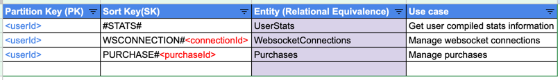

# SaaS Serverless Boilerplate

Backend for SaaS using AWS serverless stack, with all the necessary microservices and infrastructure.

---

### Overview

This project creates a serverless structure for all basic backend needed for a SaaS product with:

- Authentication using AWS Cognito
- AWS DynamoDB for database
- AWS S3 bucket for file storage
- Optional AWS VPC with public and private subnets, with a NAT instance
- Stripe webhook integration
- REST endpoints using API Gateway and Lambda

DynamoDB table internal modeling:


### Prerequisites

- A
  pre-configured [AWS Route53 hosted zone](https://docs.aws.amazon.com/Route53/latest/DeveloperGuide/CreatingHostedZone.html)
- A
  pre-configured [AWS SES verified identity](https://docs.aws.amazon.com/ses/latest/dg/verify-addresses-and-domains.html)
- [Install Serverless Framework](https://serverless.com/framework/docs/providers/aws/guide/installation/)
- [Configure AWS CLI](https://serverless.com/framework/docs/providers/aws/guide/credentialsProvider/)

### Installation

Clone the project.

``` bash
$ git clone git@github.com:renanwilliam/serverless-saas-starter.git
```

Enter the directory

``` bash
$ cd backend
```

Install all dependencies

``` bash
$ npm install
```

**<u>Important</u>**: don't forget to create an `.env` file based on `.env.example` file.

### Using

Deploy the project

``` bash
$ serverless deploy
```

Deploying only one function

``` bash
$ serverless deploy function -f hello
```

#### Running Tests

Run your tests with:

``` bash
$ npm run test
```

We use [jest](https://facebook.github.io/jest/docs/en/getting-started.html#content) for testing.

#### Code tooling

- [serverless-esbuild](https://github.com/floydspace/serverless-esbuild) is being used to package dependencies and
  transpile. Compatible with Typescript and Javascript.
- [prettier](https://prettier.io/) is being used to formmating and is pre-configured to format the code
  with `yarn run prettier-format`.
- [typescript-eslint](https://typescript-eslint.io/) is pre-configured for linting the code with `yarn run eslint`.
